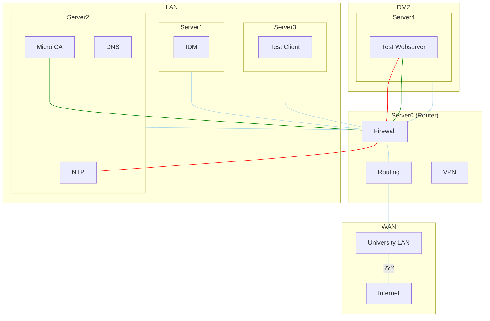

# Introduction
Currently we have been exploring the feasibility of switching to automating all of our tasks with [Ansible](ansible), and simulating the testbed's core infrastructure with [Vagrant](vagrant). At the moment, the layout of the test environment is evolving rapidly, so some of this documentation may be out of date.  
# Reasoning
While our testbed (corenet) was once setup with all the services and organization practices needed for easy administration, the decade plus of service combined with a constant flux of new admins has introduced special cases, state, legacy software, and undocumented *features*, into our system. While a concentrated effort on updating the software used, reinstating older practices, and removing unused features would fix the problem, the underlying cause would remain: In an academic environment in particular, it is important to document all of our features and allow student administrators to experiment safely.  
To this end, we have been looking into creating a virtual environment to test our testbed on, and adding idempotent automation tools that will help reduce state and provide some level of self documentation. This project aims to improve 4 areas:
1. Provide a single repository that contains all of the automation scripts needed to recreate the testbed's core infrastructure from scratch.  
2. Provide documentation to the tools and software used in the testbed, both through the innate self documenting properties of Ansible, and a repository wiki.  
3. Allow for administrators to simulate the testbeds infrastructure and changes to it with a network of virtual machines.  
4. Provide a place for students to learn about and use industry standard tools on real hardware (after confirming it won't brick things on virtual hardware).

# Setup  
See the [setup page](virtual-testbed-setup)

# Physical Layout
Virtual machines are generated in Vagrant by parsing the Ansible inventory files in the `/inventory[_testing]/host_vars` directory. All machines have at least three network interfaces:
- A NAT interface that is used by vagrant (does not exist on the physical machines)  
- A hosts only net that is used to connect with ansible (does not exist on the physical machines)  
- One or more intnets (not visible to host machine) which represent the actual networks the servers are connected to (wan, lan, dmz)  

Every machine is given a name, groups, and a list of roles. The hosts and groups are used by Ansible to generate dns entries. Which are added to the vars file in `/inventory[_testing]/group_vars/dns.yml`.

> **NOTE** support is new to github, and still having some growing pains, if it doesn't render, this is mermaid code, see github [issue 11612](https://github.com/github/feedback/discussions/11612) 

# Project Layout
Currently the seperation of roles and groups is somewhat vague, and will likely need to be better defined in a future refactor. Ideally, groups define functionality of a particular service, and roles are used for shared functionality across services. At the moment, roles are almost exclusively used as they are generally easier to work with. The project layout generally follows the [directory layout](https://docs.ansible.com/ansible/2.3/playbooks_best_practices.html#directory-layout) suggested by Ansible. Currently the repository is in a rapid prototyping phase, but once core functionallity is added there will be a focus on cleaning up the layout and documenting each module.  

## Roles:  

